<h1 align="center">👋 Hi, I'm Adeel Naeem</h1>
<h3 align="center">AI & Automation Engineer</h3>

 I design agentic AI workflows and automation systems that transform manual, repetitive processes into scalable, reliable, and observable pipelines.

  <picture>
    <source media="(prefers-color-scheme: dark)" srcset="assets/dark(1).svg">
    <source media="(prefers-color-scheme: light)" srcset="assets/light(1).svg">
    
  </picture>

---

  
  
  
  

---

## 🎯 Focus Areas  
-  **Agentic AI Orchestration** – multi-step tools, memory-bounded agents, and reasoning pipelines  
-  **Retrieval-Augmented Generation (RAG)** – chunking, embeddings, fallback chains  
-  **Workflow Automation** – n8n, Make.com, multi-system orchestration  
-  **Data-Driven Decisions** – tracking, logging, observability  

---

## 🛠️ Core Stacks  

**LLM / Agentic:** LangChain · RAG · OpenAI GPT · Embeddings · Whisper  
**Automation:** n8n · Make.com · Webhooks · Scheduling · Error Handling  
**Build / Data:** Python · SQL · REST APIs · JSON · Data Parsing  
**Storage:** MySQL · PostgreSQL · MS SQL Server · Baserow · Vector DB (Chroma / Pinecone basics)  
**Interfaces / Tools:** Streamlit  · Notion · Git · GitHub Copilot  .MongoDB
**Practices:** Prompt Design · Tool Chaining · Retrieval Evaluation · Cost Optimization   

---

## 🌟 Highlight Projects  

| Project | Description | Tech Stack | Impact |
|--------|-------------|-----------|-------|
| **AI Proposal Pitch Deck Generator** | Generates investor-ready pitch decks from a single prompt | Gemini , python ,React , | ⏱️ Reduced deck creation time by **80%** |
| **AI News Summarizer** | Summarizes daily tech news with sentiment analysis | Python,Mongo DB, Hugging Face , n8n | 📰 Saves users **30+ mins/day** |
| **End-to-End Email Automation** | Orchestrated multi-pathway hiring workflow | n8n, Gmail , Response | 👥 Cut manual HR work by **70%** |
|**Numl-RAG Chatbot** | generate responses according to user query |python, langchain,huggingface,gemini| communicate with user/students who wants to take information about the university admission.**Using NUML official Docoments** |

---

## 📊 GitHub Stats  

  
  

---

## 🧠 Core Tech (Focused)

  
  
  
  
  
  
  

---

## 📬 Connect  

  
  
  

---

✨ *Let’s build something amazing together!* 

